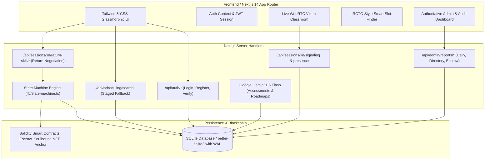
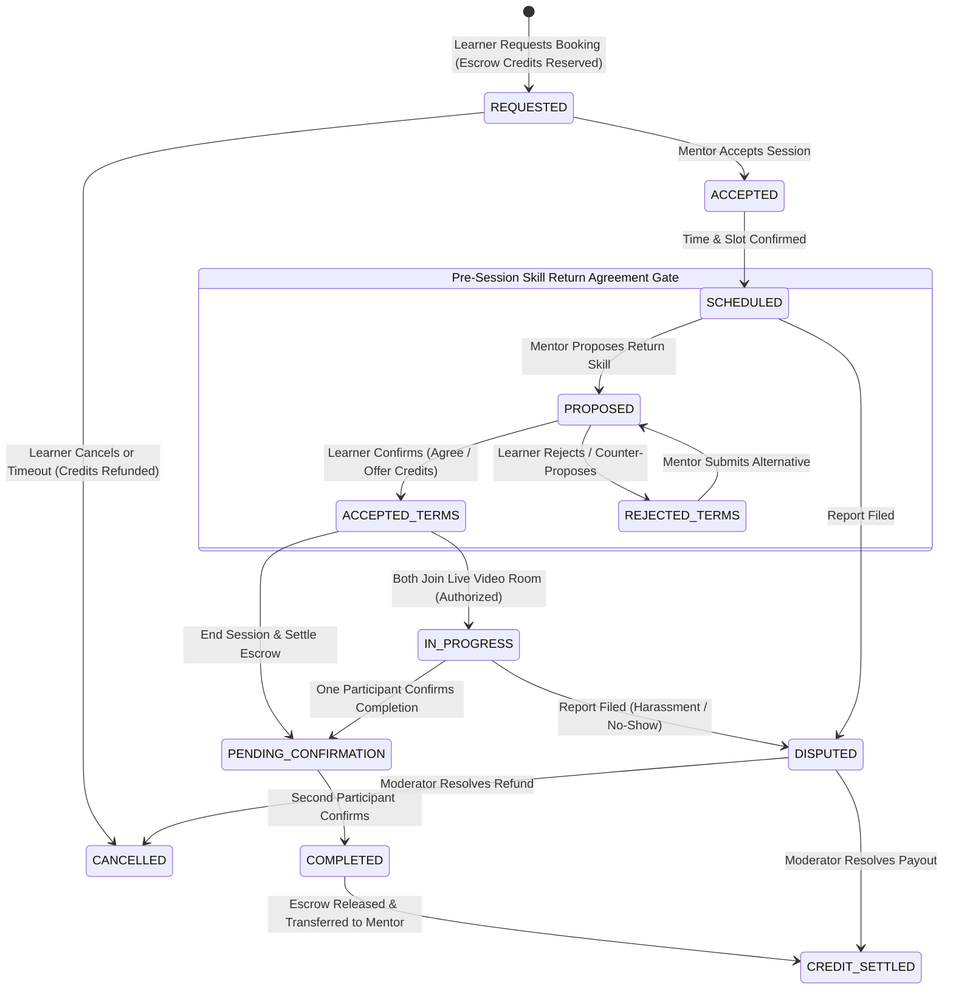

# 🎓 SkillSwap Campus (Recipro Protocol)

> **"A Decentralized Peer-to-Peer Campus Skill Barter Economy & Collaborative Video Classroom."**

SkillSwap Campus is an open, production-grade campus learning protocol where college students exchange knowledge and mentorship instead of money. Students teach subjects they have mastered to earn zero-fee **Skill Credits**, and spend those credits learning subjects from other verified campus mentors.

---

## 📑 Table of Contents
1. [System Architecture](#-system-architecture)
2. [Session Lifecycle & State Machine](#-session-lifecycle--state-machine)
3. [Key Subsystems & Features](#-key-subsystems--features)
4. [Live Video Classroom & WebRTC Signaling](#-live-video-classroom--webrtc-signaling)
5. [Database Schema Specification](#-database-schema-specification)
6. [API Route Reference](#-api-route-reference)
7. [Demo Accounts & Test Scenarios](#-demo-accounts--test-scenarios)
8. [Installation & Local Setup](#-installation--local-setup)
9. [Automated Test Suites](#-automated-test-suites)

---

## 🏛️ System Architecture



---

## 🔄 Session Lifecycle & State Machine



---

## 🌟 Key Subsystems & Features

### 1. Unified Authentication & Role System
- **Single-flow login**: Clean, standard `Email` and `Password` inputs with no rigid role selector blocks.
- **Dynamic User Capabilities**: Users are not trapped into rigid roles. Any student can teach skills as a Mentor or book sessions as a Learner.
- **Flexible Email Validation**: Validates any campus domain (`@campus.edu`, `@ait.edu.in`, `@nit.ac.in`) alongside international institution formats.

### 2. IRCTC-Style Smart Slot Finder & 15-Min Gap Protection
- **Separation of Availability vs. Ranking**: Distinguishes true physical free time from preference ratings.
- **15-Minute Buffer Protection**: Subtracts a 15-minute preparation buffer from candidate mentor slots before and after any existing booking.
- **3-Tier Staged Discovery**:
  1. *Stage 1 (Own College)*: Matches mentors from the learner's college.
  2. *Stage 2 (Partner Campuses)*: Fallback to mentors in regional partner colleges.
  3. *Stage 3 (Learner Request Pool)*: Broadcasts an open demand request to mentors campus-wide.

### 3. Pre-Session Return Skill Negotiation & Session Entry Gate
- **Direct Skill Exchanges (`return_type === 'SKILL'`)**:
  - Mentor specifies what skill they expect in return (e.g., Python $\leftrightarrow$ UI/UX Design).
  - Learner confirms with 4 actions:
    1. `Accept Exchange` (Agrees to teach requested return skill)
    2. `Offer Skill Credits Instead` (Transfers escrow credits)
    3. `Request Different Skill` (Counter-proposal)
    4. `Reject Requirement`
- **Server-Side Video Gate**: WebRTC video room tokens and entry are strictly blocked until the agreement is `ACCEPTED`.

---

## 📹 Live Video Classroom & WebRTC Signaling

- **Hardware Camera Capture & Studio Canvas Fallback**:
  - Automatically captures 720p HD webcam video via `navigator.mediaDevices.getUserMedia`.
  - In headless or restricted environments, dynamically renders a 30fps animated canvas stream featuring facial avatars and voice waveform visualizers so that **faces and active motion are always visible**.
- **Real-Time WebRTC Peer Signaling**:
  - Exchanging SDP Offers, Answers, and ICE candidates persisted via `session_signaling_messages`.
- **Collaborative Code Scratchpad**:
  - Shared interactive code and note workspace synchronized in real time to the SQLite database.
- **In-Room Encrypted Chat**:
  - Persistent, XSS-sanitized chat messages logged in `chat_messages`.
- **Screen Sharing**:
  - One-click screen sharing via `navigator.mediaDevices.getDisplayMedia`.

---

## 🗄️ Database Schema Specification

The application uses an ACID-compliant SQLite database with WAL mode enabled:

| Table Name | Description | Key Fields |
| :--- | :--- | :--- |
| `users` | Campus user accounts | `id`, `email`, `password_hash`, `role`, `status`, `user_type` |
| `profiles` | Extended student profiles | `user_id`, `display_name`, `college`, `major`, `year`, `trust_score` |
| `skills` | Master skill catalog | `id`, `name`, `category`, `icon`, `is_active` |
| `user_skills` | Teaching skills & verified levels | `user_id`, `skill_id`, `proficiency`, `verification_status`, `score` |
| `user_learning_goals` | Skills a student wants to learn | `user_id`, `skill_id`, `target_proficiency`, `priority` |
| `availability_slots` | Mentor recurring schedule windows | `id`, `user_id`, `day_of_week`, `start_time`, `end_time` |
| `sessions` | Session state machine records | `id`, `skill_id`, `teacher_id`, `learner_id`, `status`, `scheduled_start`, `credits_amount` |
| `session_exchange_agreements` | Return skill barter terms | `id`, `session_id`, `requested_return_skill_name`, `return_type`, `status`, `proposed_by`, `accepted_by` |
| `session_signaling_messages` | WebRTC SDP & ICE signals | `id`, `session_id`, `sender_id`, `receiver_id`, `signal_type`, `payload_json` |
| `session_room_presence` | Live video participant states | `session_id`, `user_id`, `camera_on`, `mic_on`, `screen_sharing`, `status`, `last_ping` |
| `session_scratchpads` | Synced collaborative scratchpad | `session_id`, `content`, `language`, `updated_by`, `updated_at` |
| `session_attendance` | Video classroom telemetry | `session_id`, `user_id`, `event_type`, `duration_seconds`, `metadata_json` |
| `chat_messages` | In-room persistent chat | `id`, `session_id`, `sender_id`, `message`, `status` |
| `skill_credit_accounts` | Zero-fee credit ledgers | `user_id`, `balance`, `escrow_balance`, `lifetime_earned`, `lifetime_spent` |
| `credit_transactions` | Immutable credit audit ledger | `id`, `reference_session_id`, `sender_id`, `receiver_id`, `amount`, `transaction_type`, `status` |
| `learning_requests` | Campus demand requests | `id`, `learner_id`, `skill_name`, `preferred_days`, `status`, `matched_mentor_id` |
| `audit_logs` | Administrative security audit trail | `id`, `actor_id`, `action`, `target_type`, `target_id`, `ip_address` |

---

## 🔌 API Route Reference

### Authentication & Profiles
- `POST /api/auth/register` — Register a new student account.
- `POST /api/auth/login` — Sign in and receive an HTTP-only JWT cookie.
- `GET /api/auth/me` — Retrieve current authenticated user profile.
- `POST /api/auth/verify-email` — Verify campus email with token.

### Discovery & Scheduling
- `POST /api/scheduling/search` — IRCTC smart slot search with 15-minute gap and college fallback.
- `GET /api/skills` — List campus skill catalog.
- `POST /api/skills` — Add a new skill to user profile.
- `GET /api/availability` — Retrieve or set mentor recurring weekly availability.

### Sessions & Return Skill Flow
- `GET /api/sessions` — List user's booked and teaching sessions.
- `GET /api/sessions/:id/exchange` — Get session exchange agreement and start readiness.
- `POST /api/sessions/:id/return-skill` — Mentor proposes a return skill.
- `POST /api/sessions/:id/return-skill/accept` — Learner confirms return exchange agreement.
- `POST /api/sessions/:id/return-skill/reject` — Learner rejects return exchange terms.
- `POST /api/sessions/:id/action` — Trigger state transitions (`START`, `CONFIRM_COMPLETION`, `CANCEL`, `DISPUTE`).

### Video Classroom & Live Signaling
- `GET /api/sessions/:id/video-token` — Authorize participant and issue room access credentials.
- `GET /api/sessions/:id/signaling` — Poll WebRTC SDP offers/answers & ICE candidates.
- `POST /api/sessions/:id/signaling` — Dispatch WebRTC signaling packet.
- `GET & POST /api/sessions/:id/presence` — Sync live camera, mic, and screen-sharing state.
- `GET & POST /api/sessions/:id/scratchpad` — Sync live collaborative code editor.
- `GET & POST /api/sessions/:id/chat` — Send and retrieve persistent in-room chat messages.
- `POST /api/sessions/:id/attendance` — Log telemetry events (`JOINED`, `LEFT`, `MUTED`, `VIDEO_ON`).

### Notifications & Learning Requests
- `GET & POST /api/notifications` — Notification inbox list and dispatch.
- `GET /api/notifications/unread-count` — Live unread notification counter.
- `PATCH /api/notifications/:id/read` — Mark individual notification as read.
- `POST /api/notifications/read-all` — Mark all user notifications as read.
- `GET & POST /api/notifications/settings` — Notification preferences (in-app & email per category).
- `POST /api/learning-requests/:id/accept-match` — YES Flow: Confirm matched course & reserve escrow credit.
- `POST /api/learning-requests/:id/decline-match` — NO Flow: Keep request active in search queue.

### Admin & Operational Auditing
- `GET /api/admin/reports/daily` — Daily report and lifetime platform metrics.
- `GET /api/admin/reports/sessions` — Comprehensive sessions directory with search, filter, and pagination.
- `GET /api/admin/reports/sessions/:id` — Deep-dive audit report of a specific session.
- `GET /api/admin/reports/users` — User-wise activity, session tallies, and credit ledgers.

---

## 👥 Demo Accounts & Test Scenarios

> [!NOTE]
> All passwords for seeded accounts are: `Password123!`

| Role / Scenario | Email | Campus College | Verification Status & Features Tested |
| :--- | :--- | :--- | :--- |
| **Python Learner** | `ananya.reddy@campus.edu` | Godavari Institute of CS | Has open Python demand request & 4 Skill Credits. |
| **Verified Python Mentor** | `rahul.reddy@campus.edu` | Andhra Institute of Tech | `PLATFORM_VERIFIED` (Score: 95%). Availability Mon/Wed/Fri 5–8 PM with a 5–6 PM booked session (tests 15-min gap & Smart Slot Finder). |
| **Mentor + Student (Web3)** | `sai.kiran@campus.edu` | Krishna Valley Eng College | Verified in Python & Solidity; Learning Figma UI/UX. Tests multi-role credit earning and spending. |
| **Pending Mentor** | `sravani@campus.edu` | Andhra Institute of Tech | `SELF_DECLARED` (Verification Pending). Tests *Verified Only* search filter toggle. |
| **Design Mentor** | `bhavya.reddy@campus.edu` | Coastal Andhra University | Figma UI/UX Mentor (`PLATFORM_VERIFIED`). Tests return barter exchanges (Python $\leftrightarrow$ UI/UX). |
| **Campus Admin** | `admin@skillswap.campus.edu` | SkillSwap Administration | Full access to `/admin`, dispute settlement, session audit logs, and escrow oversight. |

---

## 🛠️ Installation & Local Setup

### 1. Prerequisites
- **Node.js** >= 18.0.0
- **npm** >= 9.0.0

### 2. Clone & Install Dependencies
```bash
git clone https://github.com/dhilleswar76/Recipro.git
cd Recipro
npm install
```

### 3. Environment Variables
Create a `.env` file in the root directory:
```env
NEXT_PUBLIC_APP_NAME="SkillSwap Campus"
NEXT_PUBLIC_APP_URL="http://localhost:3000"
DATABASE_URL="./data/skillswap.db"
AUTH_SECRET="skillswap-super-secret-jwt-key-for-local-development-min32bytes"
GEMINI_API_KEY="" # Optional: Leave blank for curated local assessment bank fallback
EMAIL_PROVIDER="development" # Options: resend | sendgrid | smtp | development
EMAIL_API_KEY=""
EMAIL_FROM="notifications@skillswapcampus.edu"
```

### 4. Database Initialization & Seeding
```bash
# Seed demo users, verified skills, and schedule slots
npm run seed
```

### 5. Start Development Server
```bash
npm run dev
```
Open [http://localhost:3000](http://localhost:3000) in your browser.

---

## 🧪 Automated Test Suites

The codebase includes 13 automated test suites covering 39 unit and integration tests:

```bash
# Run all 13 test suites
node --test tests/session_tracking_notifications.test.js tests/admin_reporting.test.js tests/domain.test.js tests/extension.test.js tests/fallback_discovery.test.js tests/flexible_auth_email_verification.test.js tests/gemini_quiz_roadmap.test.js tests/learning_requests_video_session.test.js tests/pre_session_return.test.js tests/return_skill_flow.test.js tests/role_auth_demo.test.js tests/smart_slot_finder.test.js tests/video_classroom_signaling.test.js
```

### Test Suite Breakdown
1. `session_tracking_notifications.test.js` — State machine transitions, persistent audit timeline in `session_events`, multi-field search & filters, notifications inbox, unread counts, mentor allocation idempotency, and email delivery logging.
2. `smart_slot_finder.test.js` — Availability vs. preference ranking, 15-min gap buffer calculation, double-booking race condition prevention.
3. `fallback_discovery.test.js` — Staged discovery fallback (Inside-College $\rightarrow$ Outside-College $\rightarrow$ Request Pool).
4. `return_skill_flow.test.js` — Pre-session exchange proposal, counter-proposal, learner acceptance, and session start lock.
5. `video_classroom_signaling.test.js` — WebRTC SDP/ICE signaling, room presence, synced scratchpad, and chat message persistence.
6. `learning_requests_video_session.test.js` — End-to-end demand request matching, classroom authorization, attendance logging, and settlement.
7. `admin_reporting.test.js` — Daily operational report, user-wise activity, session classification, and dispute resolution.
8. `flexible_auth_email_verification.test.js` — Campus email validation and registration invariants.
9. `gemini_quiz_roadmap.test.js` — AI-generated and local fallback quiz generation and curriculum roadmaps.
10. `role_auth_demo.test.js` — Clean authentication UI, bcrypt password hashes, and database idempotency.
11. `pre_session_return.test.js` — Exchange agreement lifecycle, counter-proposals, and credit escrow reservation.
12. `domain.test.js` — Data models and validation rules.
13. `extension.test.js` — Verification extensions and API helpers.

---

## 📄 License
MIT License. Developed for SkillSwap Campus & Recipro Protocol.
